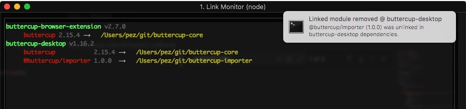

# linkmon
> NPM link monitor CLI utility



## About

Monitor and display NPM-linked project dependencies in the terminal. Watches directories and displays linked projects so you can keep track of what is linked where.

Why? I frequently find that some operations result in npm stripping my linked modules and replacing them with copies from the registry, which can be very frustrating during development across multiple libraries. This project provides aid by showing you all links so you can keep track of what is linked where.

**`linkmon` can also notify you when a linked dependency becomes unlinked!**

## Usage

`linkmon` id designed as a CLI utility first:

```
Usage: linkmon [options] [arguments]

    Watch a directory:
        linkmon ~/programming/projects
    Watch multiple directories, with notifications:
        linkmon /Users/lucy/git ~/temp/my-project --notify
    Custom watch interval (30 seconds):
        linkmon some-dir --interval=30

Options:
    --interval=             Watch interval, in seconds, for monitoring
                            the provided project directories. Defaults
                            to 15 seconds.
    --notify                Enable operating-system notifications. Is
                            disabled by default. Requires a GUI such
                            as Mac OS or Windows.

Arguments:
    Provide one or more directories for scanning and monitoring. A
    directory can either contain one or more further directories that
    house NodeJS projects, or can be a NodeJS project itself. A
    directory is classified as a NodeJS project if it contains a
    package.json file and a node_modules directory.
```
